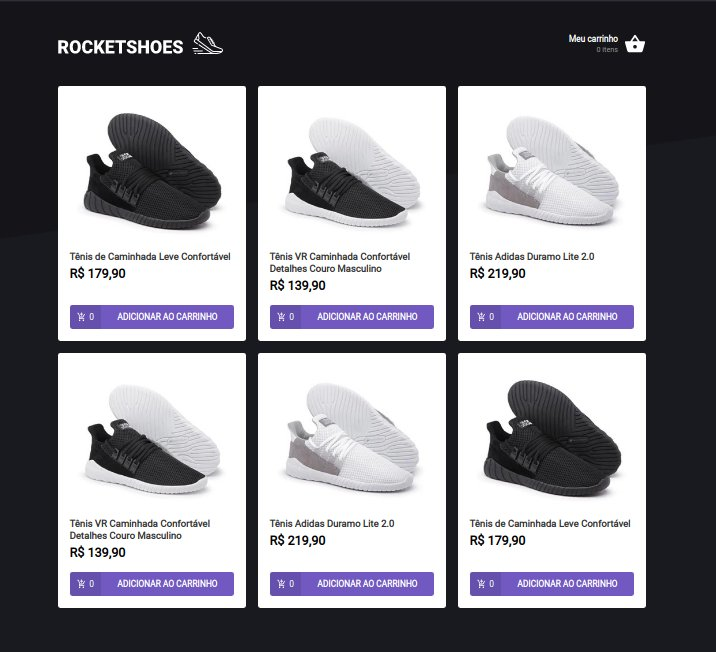
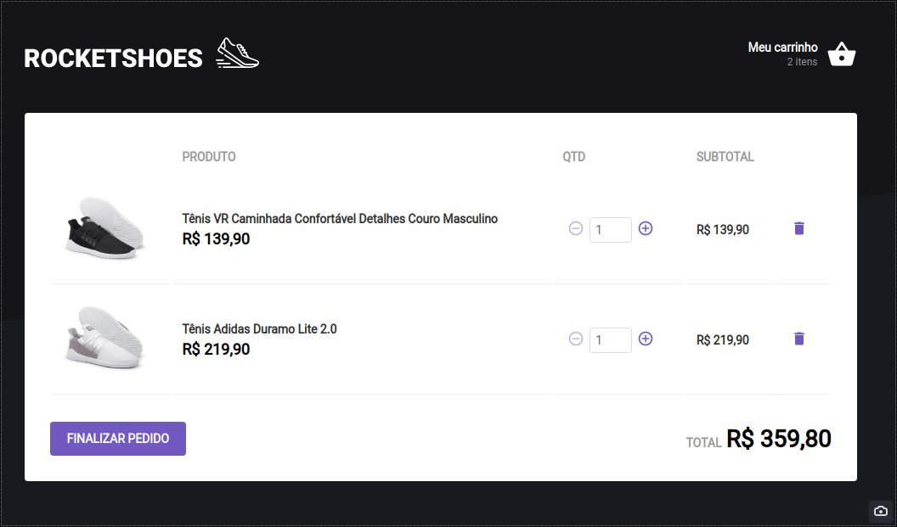
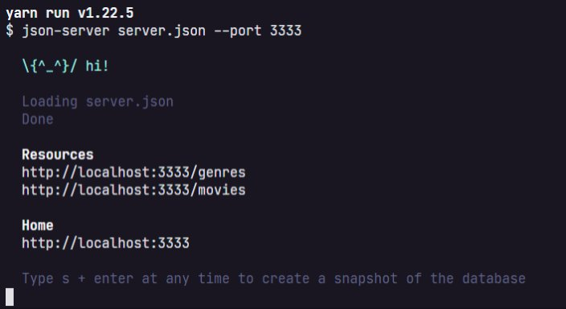
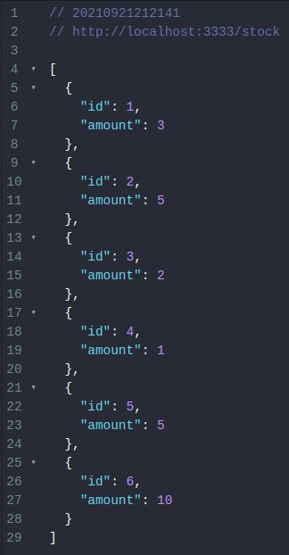
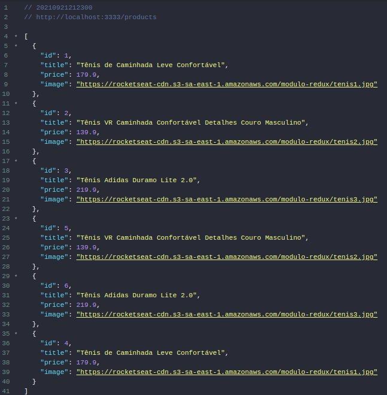

<p align="center">
  
</p>

<p align="center">
  <a href="#-tecnologias">Tecnologias</a>&nbsp;&nbsp;&nbsp;|&nbsp;&nbsp;&nbsp;
  <a href="#-projeto">Projeto</a>&nbsp;&nbsp;&nbsp;|&nbsp;&nbsp;&nbsp;
  <a href="#memo-licença">Licença</a>
</p>
<br>

<p align="center">
  
     
</p>

## 🚀 Tecnologias

Esse projeto foi desenvolvido com as seguintes tecnologias:

- Typescript
- Javascript
- HTML

[Ver aplicação](https://rocketshoes-henna.vercel.app){:target="_blank" rel="noopener"}

## 💻 Projeto
Nessa aplicação o seu principal objetivo é criar um hook de carrinho de compras. O projeto terá acesso a duas páginas, um componente e um hook para implementar as funcionalidades pedidas nesse desafio:

- Adicionar um novo produto ao carrinho;
- Remover um produto do carrinho;
- Alterar a quantidade de um produto no carrinho;
- Cálculo dos preços sub-total e total do carrinho;
- Validação de estoque;
- Exibição de mensagens de erro;
- Entre outros.


### Fake API com JSON Server

Na aplicação é utilizado o JSON Server para simular uma API que possui as informações de stock e products. 

Navegue até a pasta criada, abra no Visual Studio Code e execute os seguintes comandos no terminal:

```bash
yarn

yarn server
```

Em seguida, você vai ver a mensagem:



Perceba que ele iniciou uma fake API com os recursos /stock e /products em localhost na porta 3333 a partir das informações do arquivo server.json localizado na raiz do seu projeto. Acessando essas rotas no seu navegador, você consegue ver o retorno das informações já em JSON:

 


e para rodar aplicação é só executar o seguinte comando no terminal:

```bash
yarn start
```

### Preservando carrinho com localStorage API

Para preservar os dados do carrinho mesmo se fecharmos a aplicação, foi utilizado o **localStorage API**

Essa é uma API que nos permite persistir dados no navegador em um esquema de chave-valor (semelhante ao que temos com objetos JSON).

### Para esse desafio, temos os seguintes testes:
:test_tube: Teste components/Header/index.tsx  
:test_tube: Testes pages/Home/index.tsx  
:test_tube: Testes pages/Cart/index.tsx  
:test_tube: Testes hooks/useCart.tsx  

## :memo: Licença

Esse projeto está sob a licença MIT. Veja o arquivo [LICENSE](LICENSE) para mais detalhes.
